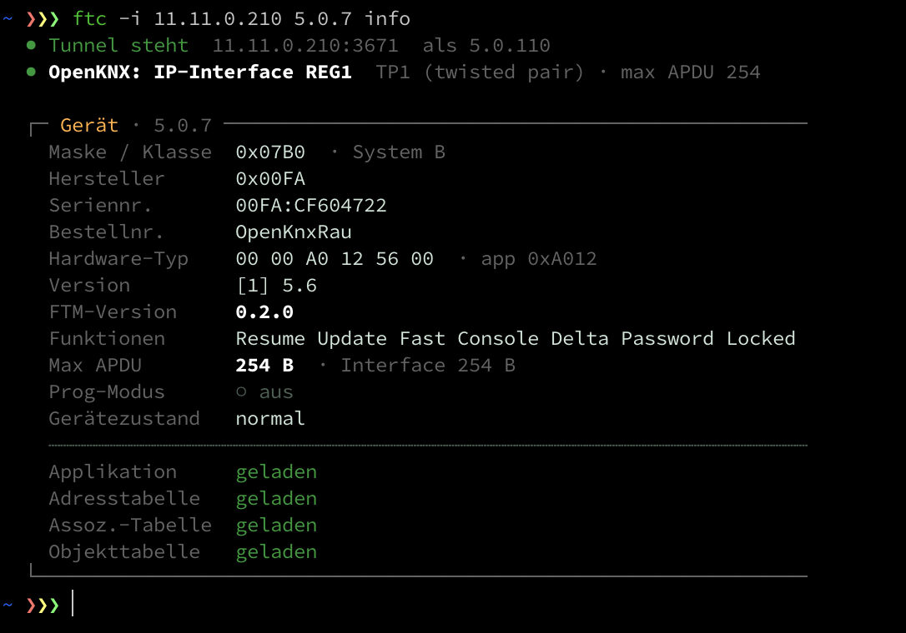

# FTC (OFM-FileTransferModule) in einem OAM aktivieren

Was in OAM-RaumController geändert wurde, um Konsole und Delta-Firmwareupdate zu bekommen — in der
Reihenfolge, in der es gemacht werden muss. Übertragbar auf jedes andere OAM; nur die Dateinamen ändern
sich.

## Wozu dieses Dokument

OAM-RaumController dient als **Vorlage**: die Integration ist hier einmal vollständig durchgezogen worden,
damit andere OAMs sie nachbauen können, ohne dieselben Sackgassen erneut zu durchlaufen.

FTC einzuschalten ist nämlich nicht „ein Define setzen". Es sind vier voneinander unabhängige Ebenen — und
drei davon melden sich **nicht**, wenn man sie vergisst:

| Ebene | Was passiert, wenn sie fehlt |
|---|---|
| Build-Switches | Das Modul läuft auf Stufe 0: elf Kommandos, **ohne jeden Zugriffsschutz** |
| ETS-Share (`op:define`) | Die Firmware kompiliert nicht (`ParamFTM_Security` unbekannt) |
| ETS-Platzierung (`<generate>`) | Der Block landet als eigener Reiter statt in „Erweitert" — **kein Fehler, keine Warnung** |
| `include/knxprod.h` neu erzeugen | Build bricht ab, obwohl `.knxprod` und `src/<Produkt>.h` korrekt sind |

Dazu zwei Dinge, die mit FTC nichts zu tun zu haben scheinen und es doch tun: die nötigen `ec/`-Branches
(Abschnitt 0) und die Flash-Deklaration der Env, die darüber entscheidet, ob Delta überhaupt laufen kann.

Deshalb ist jede Zahl hier gemessen und jeder verworfene Weg mit dem Grund vermerkt. Wer nur die Schritte
will, folgt 0 bis 6 der Reihe nach; wer wissen will *warum*, findet es in den Zwischenabschnitten.

**Nur die Schritte, ohne Begründungen?** → [FTC-Integration-TLDR.md](FTC-Integration-TLDR.md)

Die Referenz des Moduls selbst liegt in `lib/OFM-FileTransferModule/doc/`, seit dem Umbau nach Zielgruppe
gegliedert: `reference/flags.md` (jeder Switch und seine Kosten), `reference/integration.md` (das allgemeine
Rezept), `guide/unlocking-a-device.md`, `guide/console.md`, `reference/delta.md`.
Diese Seite ist das durchgerechnete Beispiel, kein Ersatz dafür.

## Inhalt

- [0. Voraussetzung: welche Branches nötig sind](#0-voraussetzung-welche-branches-nötig-sind)
  - [Warum der knx-Branch faktisch dazugehört](#warum-der-knx-branch-faktisch-dazugehört)
  - [Warum OFM-UsbExchange zwingend wird](#warum-ofm-usbexchange-zwingend-wird)
- [Ausgangslage: was ein eingebundenes, aber unkonfiguriertes FTM liefert](#ausgangslage-was-ein-eingebundenes-aber-unkonfiguriertes-ftm-liefert)
- [1. Build-Switches — `platformio.custom.ini`](#1-build-switches--platformiocustomini)
  - [Dazu passend: die TPUart-Diagnoseschalter](#dazu-passend-die-tpuart-diagnoseschalter)
  - [Prüfen, ob sie wirklich greifen](#prüfen-ob-sie-wirklich-greifen)
- [2. ETS-Seite — Teil 1: ein `op:define` je Produkt-XML](#2-ets-seite--teil-1-ein-opdefine-je-produkt-xml)
- [2b. ETS-Seite — Teil 2: das `op:define` allein setzt den Block an die falsche Stelle](#2b-ets-seite--teil-2-das-opdefine-allein-setzt-den-block-an-die-falsche-stelle)
  - [Warum es keinen kürzeren Weg gibt](#warum-es-keinen-kürzeren-weg-gibt)
  - [Offene Frage an dich Waldemar (OpenKNXproducer)](#offene-frage-an-dich-waldemar-openknxproducer)
  - [So sieht das Ergebnis in der ETS aus](#so-sieht-das-ergebnis-in-der-ets-aus)
  - [`src/LocalApplication.xml` ist nicht die Basisvorlage](#srclocalapplicationxml-ist-nicht-die-basisvorlage)
  - [Die Template-Variante — hier bewusst nicht benutzt](#die-template-variante--hier-bewusst-nicht-benutzt)
- [2c. Der ftc-Client im Release — bauen und kopieren sind zwei Schritte](#2c-der-ftc-client-im-release--bauen-und-kopieren-sind-zwei-schritte)
  - [Der Mechanismus](#der-mechanismus)
  - [Woher der Hook die Binaries nimmt — in dieser Reihenfolge](#woher-der-hook-die-binaries-nimmt--in-dieser-reihenfolge)
  - [Der Bau gehört ins `Build-Release.ps1` des OAM](#der-bau-gehört-ins-build-releaseps1-des-oam)
  - [Zwei Eigenschaften, die man kennen sollte](#zwei-eigenschaften-die-man-kennen-sollte)
- [3. Versions-Pin — `src/<Produkt>.conf.xml`](#3-versions-pin--srcproduktconfxml)
- [4. ApplicationVersion anheben](#4-applicationversion-anheben)
- [5. `include/knxprod.h` neu erzeugen — nicht überspringen](#5-includeknxprodh-neu-erzeugen--nicht-überspringen)
- [6. Prüfen](#6-prüfen)
  - [Am laufenden Gerät gegenprüfen](#am-laufenden-gerät-gegenprüfen)
- [Was es kostet](#was-es-kostet)
- [Funktioniert Delta auf dem eigenen Board?](#funktioniert-delta-auf-dem-eigenen-board)
  - [Der Report beschreibt das *deklarierte* Layout, nicht den Chip](#der-report-beschreibt-das-deklarierte-layout-nicht-den-chip)
  - [Wenn ein Produkt wirklich kleine Boards hat](#wenn-ein-produkt-wirklich-kleine-boards-hat)
- [Stolperfallen aus diesem Umbau](#stolperfallen-aus-diesem-umbau)
- [Offen / geplant](#offen--geplant)
  - [Behoben: `scripts/release/Post.ps1` lag in keinem Clone](#behoben-scriptsreleasepostps1-lag-in-keinem-clone)
  - [Das mächtigere `Build-Release.ps1` nach OGM-Common](#das-mächtigere-build-releaseps1-nach-ogm-common)
- [Nicht Teil dieser Änderung](#nicht-teil-dieser-änderung)

## 0. Voraussetzung: welche Branches nötig sind

FTC in dieser Ausbaustufe läuft nicht gegen die reinen `v1`-Stände. Geprüft, nicht angenommen — wobei
„nicht zwingend" hier heißt: *aus dem Code hergeleitet*, nicht am Gerät nachgestellt.

| Repo | Branch hier | zwingend nötig? |
|---|---|---|
| `OGM-Common` | `ec/v1dev-ec` | **ja** — `OPENKNX_FTC_CONSOLE` / `_lineSink` in `Console.h` existiert auf `origin/v1` überhaupt nicht (0 Treffer) |
| `OFM-FileTransferModule` | `ec/v1dev` | **ja** — das ist das Modul selbst (0.2.0, 97 Commits vor `origin/v1`) |
| `OFM-UsbExchange` | `ec/pr-littlefs-align-flash-sector-8MB-4MB` | **ja, sobald 4MB/8MB benutzt wird** — siehe unten |
| `knx` | `ec/v1dev-ec` | **empfohlen, praktisch vorausgesetzt.** Für FTC selbst formal nicht nötig (die 9 FTC-Dateien dort hängen ausnahmslos an `OPENKNX_FTC_CLIENT`, das dieses Profil nicht setzt) — aber der Branch pinnt den TPUart-Treiber auf `ec/1.3.0-beta.1`, und **nur der** bringt die Schalter aus Abschnitt 1 mit. Außerdem: der Bau gegen ein reines `v1` ist **nie getestet worden** und wird es auch nicht |
| `OFM-Network` | `ec/v1dev-ec` | **optional** — 0 FTC-Referenzen, hat mit FTC nichts zu tun |

### Warum der knx-Branch faktisch dazugehört

`knx` zieht den TPUart-Treiber als eigene Abhängigkeit, und die beiden Stände unterscheiden sich:

| knx-Stand | gezogener Treiber |
|---|---|
| `ec/v1dev-ec` | `tpuart#ec/1.3.0-beta.1` |
| `origin/v1` | `tpuart#1.1.0` |

In `1.1.0` gibt es **keinen** der Schalter aus Abschnitt 1: `TPUART_API_LEVEL`, `TPUART_BCU_HEALTH`,
`TPUART_BCU_REGISTER_INFO` und `TPUART_NCN_TW_AUTORESET` kommen dort alle auf null Treffer. Wer gegen ein
reines `v1` baut, bekommt die TP-Diagnose also nicht — und `TPUART_NCN_TW_AUTORESET` ist kein
Diagnoseschalter, sondern das Selbstheilen der NCN-Thermal-Warning.

### Warum OFM-UsbExchange zwingend wird

`origin/v1` setzt für 4MB `board_build.filesystem_size = 2616064`. Das ist **kein Vielfaches von 4096**
(2616064 / 4096 = 638,6875). Damit liegt `_FS_start` nicht auf einer Sektorgrenze, jeder LittleFS-Block
überlappt zwei Flash-Erase-Sektoren, und das Schreiben von Block N+1 löscht das Ende von Block N —
Dateien über 4 KB werden korrupt. Der Branch korrigiert auf 2617344 = 639 × 4096.

Wer die Envs auf `RP2040_EXCHANGE_4MB` umstellt (siehe unten) und dabei auf `origin/v1` bleibt, baut sich
genau diesen Datenverlust ein. Der Build meldet dazu nichts.

## Ausgangslage: was ein eingebundenes, aber unkonfiguriertes FTM liefert

Das Modul zu verlinken und `openknx.addModule(5, openknxFileTransferModule)` aufzurufen reicht **nicht**.
Ohne gesetztes `-D` löst `FileTransferConfig.h` auf Stufe 0 auf, und das Gerät beantwortet elf Kommandos:

```
FileUpload (safe) · FileInfo · FilesystemInfo · Exists · Cancel
Format · Rename · FileDelete · FwUpdate · ModuleVersion · CheckFeatures
```

Keine Konsole, kein Download, kein Delta — und **kein Zugriffsschutz**: `Format`, `FileDelete`, `Rename`,
`FileUpload` und `FwUpdate` stehen jedem offen, der die physikalische Adresse kennt. In diesem Zustand war
dieses OAM vor der Änderung.

## 1. Build-Switches — `platformio.custom.ini`

Drei Zeilen im `[custom]`-Block, damit alle Envs sie erben:

```ini
[custom]
build_flags =
  ...
  ; --- OFM-FileTransferModule (FTC) -- see lib/OFM-FileTransferModule/doc/reference/flags.md ---
  -D OPENKNX_FTC_PROFILE_DEVICE        ; end-device profile: security + download + dirops + fastupload
  -D OPENKNX_FTC_CONSOLE               ; console tunnel (obj 160) -- read by OGM-Common Console.h, which never sees the module header, so it must be -D
  -D OPENKNX_FTC_DELTA_UPDATE          ; firmware as a patch against the running image; no profile sets it (it hangs on the board, not the device class)
```

Warum genau diese drei:

- `PROFILE_DEVICE` ist das Endgeräte-Profil. Es schaltet `SECURITY`, `DOWNLOAD`, `DIROPS` und
  `FASTUPLOAD` ein (auf ESP32 zusätzlich `GZIP_UPDATE`). `PROFILE_MANAGER` nur dann, wenn das Gerät
  *andere* Geräte betanken soll — das kostet ~120 KB und braucht zusätzlich `OPENKNX_FTC_CLIENT`.
- `CONSOLE` wird von keinem Profil gesetzt. Es wird von `OGM-Common/src/OpenKNX/Console.h` gelesen, wo es
  ein **Datenfeld** (`_lineSink`) schaltet. Diese Datei sieht `FileTransferConfig.h` nie, der Switch muss
  also als echtes `-D` ankommen — sonst sind sich die beiden Hälften über das Klassenlayout uneinig.
- `DELTA_UPDATE` steht ebenfalls in keinem Profil, weil es vom Flash des Boards abhängt, nicht von der
  Geräteklasse.

`PROFILE_DEVICE` ohne `CONSOLE` ist ein Build-Fehler, der die fehlende Zeile benennt. Das ist Absicht.

### Dazu passend: die TPUart-Diagnoseschalter

Der knx-Stack zieht seit `6ae5db2` den TPUart-Treiber als eigene Abhängigkeit
(`https://github.com/OpenKNX/tpuart#ec/1.3.0-beta.1`). Der Treiber bringt Diagnose mit, die **komplett
hinter Opt-in-Schaltern liegt** — ohne sie ist sie wegkompiliert, ohne Fehler und ohne Hinweis.

Zusammen mit der FTC-Konsole werden diese Schalter erst wertvoll: `bcu` und `bcu stat` sind damit über den
Bus abfragbar, ohne ans Gerät zu müssen. Deshalb stehen sie hier direkt neben den FTC-Zeilen:

```ini
  ; --- TPUart driver (pulled in by the knx stack) -- diagnostics reachable over the FTC console ---
  -D TPUART_NCN_TW_AUTORESET           ; NCN thermal-warning auto-heal via one guarded U_RESET; robustness, not diagnostics
  -D TPUART_BCU_HEALTH                 ; 'bcu' report shows BCU<Health> and the NCN error counters
  -D TPUART_BCU_REGISTER_INFO          ; 'bcu stat' NCN rails + chip identity; costs one identifyNcnChip() excursion at boot
```

- `TPUART_NCN_TW_AUTORESET` ist **kein** Diagnose-, sondern ein Robustheitsschalter: eine
  NCN-Thermal-Warning heilt sich über einen geführten `U_RESET` selbst. Gehört auf jedes Gerät mit NCN.
- `TPUART_BCU_HEALTH` und `TPUART_BCU_REGISTER_INFO` schalten den Chip-Report frei.
  **Vorbehalt:** `TPUART_BCU_REGISTER_INFO` ruft `identifyNcnChip()` beim Boot auf. Der Treiber-Kommentar
  nennt das ausdrücklich einen Boot-Abstecher, den ein Produkt ohne Chip-Report nicht zahlt.

Gemessen auf `release_DEVICE_UP1_PM_HF`: die drei zusammen **+2360 B Flash, ±0 B RAM**.

**Nicht setzen auf einem normalen TP-Gerät:** `OPENKNX_HW_BUSMON` und `TPUART_BUSMON_INTEGRITY`. Das ist
ein Interface-Feature (Busmonitor über einen ETS-Busmonitor-Tunnel) und hängt an der Maske. OAM-IP-Interface
setzt es, weil es ein Interface ist; bei Maske 0x07B0 ist es fehl am Platz.

### Prüfen, ob sie wirklich greifen

Das ist der Punkt, an dem man sich täuscht: ein fehlender Schalter erzeugt **keine** Meldung, die Diagnose
ist einfach nicht da. Am fertigen Image nachsehen:

```sh
strings .pio/build/<env>/firmware.elf | grep -c "NCN Rails"   # 0 = Schalter fehlt, >0 = aktiv
```

## 2. ETS-Seite — Teil 1: ein `op:define` je Produkt-XML

Der FTC-Zugriffsschutz ist in der ETS parametrierbar (Stufe, Passwort, Auto-Logout), also muss das Share
des Moduls eingebunden werden. In **jedes** Produkt-XML (hier `src/RaumController.xml` **und**
`src/RaumController-Release.xml`), neben die anderen `op:define`:

```xml
<op:define prefix="FTM"
           share="../lib/OFM-FileTransferModule/src/FileTransfer.share.xml"
           noConfigTransfer="true"
           ModuleType="13">
  <op:verify File="../lib/OFM-FileTransferModule/library.json" ModuleVersion="%FTM_VerifyVersion%" />
</op:define>
```

- `ModuleType` muss **im eigenen Produkt frei** sein. 13 war hier unbenutzt; prüfen mit
  `grep -oE 'ModuleType="[0-9]+"' src/<Produkt>.xml | sort -u`.
- Das Share bringt **0 ComObjects** mit, KO-Layout und KO-Offsets verschieben sich also nicht.
- `prefix="FTM"` ist fest — die Firmware liest `ParamFTM_Security`, `ParamFTM_Password` und
  `ParamFTM_AuthTimeout`. Ein anderes Prefix kompiliert zu nichts Brauchbarem.

## 2b. ETS-Seite — Teil 2: das `op:define` allein setzt den Block an die falsche Stelle

Das Share liefert seine Parameter in einem `Channel`, dessen `ParameterBlock` **`ExtendedInject`** heißt.
Der Name ist der Vertrag: der Block gehört in Commons Seite „Erweitert", nicht auf eine eigene.

Mit nur dem `op:define` von oben greift die **Default-Generierungsprozedur** des Producers. Ihre generische
per-define-Schleife nimmt den `Channel` des Shares auf und macht daraus einen **eigenen Top-Level-Reiter
„Datei-Transfer"** neben „Netzwerk". Das sieht nach Erfolg aus — die Parameter existieren, die ETS zeigt
sie an, nichts warnt — ist aber nicht das gewollte Layout.

Damit es unter `OpenKNX > Erweitert` landet, muss der BASE-Channel an Ort und Stelle nachgebaut werden,
und das heißt: **die Default-Prozedur ersetzen**. In das `<generate>`-Element **jedes** Produkt-XML, an
die Stelle von `<generate />`:

```xml
<generate>
  <Dynamic>
    <Channel Id="%AID%_CH-BASE" Number="BASE" Name="BASE_Main" Text="OpenKNX" Icon="openknx" HelpContext="BASE-OpenKNX">
      <op:include href="../lib/OGM-Common/src/Common.share.xml" xpath="//ApplicationProgram/Dynamic/Channel/ParameterBlock[@Name='Basic']" prefix="BASE" />
      <ParameterBlock Id="%AID%_PB-nnn" Name="Extended" Text="Erweitert" Icon="format-list-text" HelpContext="BASE-OpenKNX">
        <op:include href="../lib/OGM-Common/src/Common.share.xml" xpath="//ApplicationProgram/Dynamic/Channel/ParameterBlock[@Name='Extended']/*" IsInner="true" prefix="BASE" />
        <op:include href="../lib/OFM-FileTransferModule/src/FileTransfer.share.xml" xpath="//Dynamic/Channel/ParameterBlock/*" IsInner="true" prefix="FTM" />
      </ParameterBlock>
      <op:include href="../lib/OGM-Common/src/Common.share.xml" xpath="//ApplicationProgram/Dynamic/Channel/*[not(self::ParameterBlock[@Name='Basic']) and not(self::ParameterBlock[@Name='Extended'])]" prefix="BASE" />
    </Channel>
    <!-- jedes weitere Modul, explizit, in op:define-Reihenfolge -->
    <op:include href="../lib/OFM-Network/src/Network.share.xml" xpath="//ApplicationProgram/Dynamic/*" prefix="NET" />
    ...
  </Dynamic>
</generate>
```

Drei Dinge daran werden leicht falsch gemacht:

- **`Name="BASE_Main"`**, nicht `Main`. Commons Share schreibt `Name="Main"`; der Producer stellt beim
  Expandieren das Prefix voran. Im Zweifel den Wert aus einer bereits erzeugten `.knxprod` ablesen.
- **Die Default-Schleife ist alles-oder-nichts.** Sobald `<generate>` ein `<Dynamic>` trägt, ist die
  per-define-Schleife weg und *jedes* Modul muss aufgeführt werden. Fehlt eins, verschwindet seine
  komplette Seite kommentarlos. Ein später hinzugefügtes `op:define` braucht hier also auch eine Zeile.
- **Es muss in jedes Produkt-XML.** Eine gemeinsame Basisdatei dafür gibt es nicht — siehe unten.

Die ETS-Kontexthilfe kommt weiterhin von allein mit, über das übliche
`<Baggages><op:includetemplate href="%share%" xpath="//Manufacturer/Baggages/*" prefix="%prefix%" /></Baggages>`.

### Warum es keinen kürzeren Weg gibt

Drei naheliegende Abkürzungen wurden ausprobiert, alle scheitern:

| Ansatz | Ergebnis |
|---|---|
| `isSubmoduleOf="BASE"` am FTM-`op:define` | ohne Wirkung auf `Dynamic`, der Reiter bleibt eigenständig |
| Ein fester Hook in `Common.share.xml` | `op:include` ist **nicht** an ein definiertes Prefix gekoppelt. Mit `prefix="ZZZ"` (nirgends definiert) wurde der Block trotzdem eingefügt — ohne Fehler, ohne Warnung, XSD-Validierung grün, Referenzen zeigen ins Leere. Ein Hook in Common landete damit in jedem OAM, auch ohne FTM |
| Bedingtes Include (`op:if` / `op:ifdef`) | gibt es nicht. Der Producer kennt nur `include`, `includetemplate`, `part`, `usePart`, `param`, `config`, `define`, `verify`, `nowarn`, `version`, `ETS`, `Enumeration`, `minOpenKNXproducerVersion`, `minModuleVersion` |

Kürzer wird es erst mit einer Producer-Erweiterung. Das ist ein Upstream-Thema, kein OAM-Thema.

### Offene Frage an dich Waldemar (OpenKNXproducer)

> Gibt es einen Weg, den ich übersehen habe — oder wäre das eine sinnvolle Producer-Erweiterung?
>
> **Problem.** Ein Modul-Share, das seinen `ParameterBlock` als `ExtendedInject` ausweist, soll in Commons
> Seite „Erweitert" gefaltet werden statt als eigener Top-Level-Reiter zu erscheinen. Damit das gelingt,
> muss das Produkt-XML den kompletten BASE-Channel nachbauen — und dabei die Default-Generierungsprozedur
> ersetzen, also **alle** Module explizit auflisten. Bei OAM-RaumController sind das 15 zusätzliche Zeilen
> plus die Pflicht, sie bei jedem neuen `op:define` nachzuziehen; wird eins vergessen, verschwindet dessen
> ETS-Seite kommentarlos. Für eine Injektion von drei Parametern ist das viel Angriffsfläche.
>
> **Was ausprobiert und verworfen wurde.** `isSubmoduleOf="BASE"` am `op:define` wirkt nicht auf `Dynamic`.
> Ein fester Hook in `Common.share.xml` scheidet aus, weil `op:include` nicht an ein definiertes Prefix
> gekoppelt ist — der Block landete dann in jedem OAM, auch ohne das Modul. Ein bedingtes Include
> (`op:if`/`op:ifdef`) gibt es nicht.
>
> **Drei denkbare Wege**, vom kleinsten Eingriff aufwärts:
>
> 1. **`op:define … noDynamic="true"`** — nimmt ein einzelnes Modul aus der per-define-Schleife heraus.
>    Die Default-Prozedur bliebe für alle anderen erhalten; das Produkt schriebe nur noch die eine
>    Injektionszeile. Kleinste Änderung, löst den Aufzählungszwang vollständig.
> 2. **`op:include` mit optionalem Prefix** (z. B. `optional="true"`) — überspringt sich still, wenn das
>    Prefix nicht definiert ist. Dann könnte der Hook in `Common.share.xml` stehen und **jedes** OAM bekäme
>    die Injektion allein durch das `op:define`, ganz ohne Produkt-XML-Änderung.
> 3. **`ExtendedInject` als Konvention in der Default-Prozedur** — die Schleife faltet einen so benannten
>    `ParameterBlock` selbsttätig in BASE/`Extended`, statt einen eigenen `Channel` zu erzeugen. Löst es
>    für alle Module auf einen Schlag, ist aber der größte Eingriff und ändert Verhalten für bestehende
>    Produkte.
>
> **Unabhängig davon ein möglicher Fehler:** ein `op:include` mit einem nirgends definierten Prefix wird
> trotzdem eingefügt. Getestet mit `prefix="ZZZ"` — der Block landete im Produkt, die erzeugten Referenzen
> zeigen ins Leere, und es gibt weder Fehler noch Warnung; die XSD-Validierung läuft durch. Eine Warnung
> „Prefix nicht definiert" würde solche Tippfehler sofort sichtbar machen.

### So sieht das Ergebnis in der ETS aus


„Zugriffsschutz Service & Wartung" steht als letzter Abschnitt **innerhalb** der Seite „Erweitert“, direkt
unter „Erweitertes Speichern“ — kein eigener Reiter in der Baumleiste links. Rechts die Kontexthilfe, die
über das Baggage des Moduls von allein mitkommt.


Dasselbe Feld in der **Werksvorgabe**. „Passwort“ und „Abmeldung bei Leerlauf“ erscheinen nur in der Stufe
„Mit Passwort“ — das erledigt ein `choose` im Share, nicht die Firmware.

Wichtig daran: `OPENKNX_FTC_SECURITY` zu übersetzen schützt noch nichts. Die Vorgabe ist **„Immer
erlaubt“**, also offen. Der Schutz ist ein ETS-Parameter und muss beim Inbetriebnehmen gesetzt werden.

*(Beide aus OAM-RaumController, Applikation 5.0.7 / ApplicationVersion 5.6, ETS 6.)*

### `src/LocalApplication.xml` ist nicht die Basisvorlage

RaumController enthält eine `src/LocalApplication.xml`, die exakt wie die Generierungsvorlage aussieht,
bis hin zur `<Dynamic>`-Schleife. **Der Producer liest sie nicht.** `<generate />` benutzt eine im Producer
eingebaute Prozedur und meldet in beiden Fällen `Generate: Using default generation procedure` — egal ob
die Datei existiert, geändert oder gelöscht wird. Änderungen daran haben null Wirkung auf die Ausgabe.

### Die Template-Variante — hier bewusst nicht benutzt

Es gibt zwei Wege, die Prozedur zu überschreiben:

| Form | benutzt von |
|---|---|
| `<generate>` mit inline `<Dynamic>`, in jedem Produkt-XML wiederholt | OAM-NeoPixel, **und dieses OAM** |
| `<generate base="Template.xml"/>` — eine echte Vorlagendatei, einmal geschrieben | OAM-IP-Router, OAM-IP-Interface |

Die `base=`-Form spart die Verdopplung über Dev- und Release-Variante und beseitigt damit die Drift-Falle
(„Dev richtig, Release falsch"). Die Aufzählung der Module wird dadurch **nicht** kürzer — sie wandert nur
in eine Datei.

**Hier wird bewusst die Inline-Form verwendet**, um nah an OAM-NeoPixel zu bleiben. Wer ein neues OAM
aufsetzt und die Wahl hat, kann genauso gut `base=` nehmen; das Ergebnis im `.knxprod` ist dasselbe.

## 2c. Der ftc-Client im Release — bauen und kopieren sind zwei Schritte

Der Release-Hook von FTM **kopiert** den PC-Client `ftc` ins Release, er **baut** ihn nicht. Gebaut wird er
vom `Build-Release.ps1` des OAM. Wer FTM neu einbindet und diesen Block vergisst, bekommt ein Release ohne
Client — ohne dass etwas fehlschlägt.

### Der Mechanismus

Eine Konvention in `Build-Release-Postprocess.ps1`: jedes Modul darf ein `scripts/release/Post.ps1`
mitbringen und damit seinen Anteil am Release zusammenstellen. Gesucht wird per Glob
`lib/*/scripts/release/Post.ps1`, in alphabetischer Pfadreihenfolge — **kein Modul wird namentlich
genannt**. Der Hook bekommt `-ReleaseRoot <absoluter Pfad von release/>` und `-BuildParam Dev|Release` und
läuft im Projektwurzelverzeichnis. Symmetrisch dazu gibt es `Pre.ps1`, das `Build-Release-Preprocess.ps1`
vor dem Firmware-Build ausführt.

FTMs Hook legt an:

```
release/Tools/ftc-cli/README.md
release/Tools/ftc-cli/Windows/{x64,x86,arm64}/ftc.exe
release/Tools/ftc-cli/Linux/{x64,arm64,armhf}/ftc
release/Tools/ftc-cli/MacOS/{x64,arm64}/ftc
```

OS und Architektur liest er aus den Env-Namen der Build-Matrix (`ftc-cli-<os>-<arch>`), ein neues Ziel
braucht im Hook also keine Änderung.

### Woher der Hook die Binaries nimmt — in dieser Reihenfolge

| Quelle | vorhanden? |
|---|---|
| 1. `OFM-FileTransferModule/ftc-cli/.pio/build/ftc-cli-<os>-<arch>/ftc[.exe]` | nur nach lokalem Matrix-Build |
| 2. `OFM-FileTransferModule/ftc-cli/release/Tools/ftc-cli/` (vorbereiteter Baum) | **git-ignored**, in einem frischen Clone leer |
| 3. nichts davon | `Tools/ftc-cli` entfällt ersatzlos |

Punkt 2 ist der, den man leicht falsch einschätzt: `ftc-cli/release/` fällt unter `[Rr]elease/` in FTMs
`.gitignore` — **null getrackte Dateien**. Nach `git clone` ist dort nichts. Ein OAM, das FTM frisch
einbindet und nie `ftc-cli` gebaut hat, landet also direkt bei Punkt 3.

### Der Bau gehört ins `Build-Release.ps1` des OAM

Genau hier liegt der Schritt, den man beim Einbinden vergisst — und genau so machen es OAM-IP-Interface
und OAM-IP-Router. Der Block steht **vor** dem Preprocess, damit ein fehlgeschlagener Client-Bau abbricht,
bevor die Firmware gebaut wird:

```powershell
$ftcCliDir = "lib/OFM-FileTransferModule/ftc-cli"
if ($env:OPENKNX_SKIP_HOSTCLI -ne "1") {
    if (Test-Path (Join-Path $ftcCliDir "platformio.ini")) {
        Write-Host "Building the PC FileTransferClient matrix (pio run -> ftc, all OS/arch)..." -ForegroundColor Cyan
        pio run -d $ftcCliDir
        if (!$?) { Write-Host "ftc-cli build failed" -ForegroundColor Red; exit 1 }
    }
}
```

Ein `pio run` baut die **ganze** Matrix: die `platformio.ini` des ftc-cli definiert eine Env je Ziel, und
ein Pre-Build-Hook zieht sich ein projektlokales `zig` für die Cross-Ziele selbst nach (`.tools/`,
gitignored). Kein manuelles Toolchain-Setup, aber beim ersten Lauf Internet.

Gemessen auf diesem Rechner: **45 s für alle acht Ziele**, ein einzelnes Host-Ziel 3 s.

IP-Interface und IP-Router bieten dafür einen `-SkipHostCli`-Schalter; dieses Skript hat keinen
`param()`-Block, deshalb hier `$env:OPENKNX_SKIP_HOSTCLI = "1"`.

**Was von welchem Host geht.** Die Matrix ist bewusst cross-fähig: sechs der acht Ziele bauen von
**jedem** Host aus, weil der Pre-Build-Hook sich dafür ein projektlokales `zig` nachzieht.

| Ziel | Engine | Host |
|---|---|---|
| linux-x64, linux-arm64, linux-armhf | zig | beliebig |
| windows-x86, windows-x64, windows-arm64 | zig | beliebig |
| macos-x64, macos-arm64 | host-clang + Xcode-SDK | **nur macOS** |

Die beiden macOS-Ziele sind die einzige Ausnahme (`die("target %s needs a macOS host")`), weil sie
`-isysroot` auf das Xcode-SDK und `-framework CoreFoundation` brauchen — das lässt sich nicht mitliefern.
Auf Linux oder Windows baut man die Matrix also ohne diese zwei.

Daraus folgt auch: **eine Änderung am ftc-Quelltext erreicht ein Release erst nach erneutem Matrix-Bau.**
Ein bestehendes `.pio/build` liefert sonst weiter die alten Binaries.

### Zwei Eigenschaften, die man kennen sollte

- **Ein fehlschlagender Hook bricht das Release nicht ab**, er warnt nur. Absicht: das sind optionale
  Begleitartefakte mit eigenem Release-Zyklus, ein Firmware-Release darf daran nicht hängen.
- **Findet er kein ftc**, entfällt `Tools/ftc-cli` und die Meldung lautet
  `ftc not found -- no Tools/ftc-cli; KNX-Upload will use an installed ftc`. Das Release ist trotzdem
  gültig — das Upload-Skript arbeitet dann mit einem selbst installierten ftc.

Ein Modul, das **nicht** unter `lib/` liegt, wird vom Glob nicht erfasst und trägt nichts bei — in diesem
OAM betrifft das `OFM-ConfigTransfer`, das über `../../` eingebunden ist.

## 3. Versions-Pin — `src/<Produkt>.conf.xml`

Passend zum `op:verify` oben:

```xml
<op:config name="%FTM_VerifyVersion%" value="0.2" />
```

Der Wert ist `major.minor` aus `lib/OFM-FileTransferModule/library.json`. Läuft das auseinander, meldet der
Producer `You need to >>> INCREASE YOUR <<< ETS ApplicationVersion ...` und nennt die Zielversion.

## 4. ApplicationVersion anheben

Ein neues Modul heißt neue Parameter und geändertes Speicherlayout, die ETS muss also eine neue
Applikationsversion sehen. Beide Varianten in der `conf.xml`:

```xml
<op:config name="%ROOM_ApplicationVersion_Dev%" value="3.7.0" />   <!-- war 3.6.0 -->
<op:config name="%ROOM_ApplicationVersion%"     value="5.6.1" />   <!-- war 5.5.1 -->
```

## 5. `include/knxprod.h` neu erzeugen — nicht überspringen

Die Firmware kompiliert gegen `include/knxprod.h`, **nicht** gegen `src/<Produkt>.h`. Der Producer schreibt
diese Datei nur, wenn man es ihm sagt:

```sh
openknxproducer create --HeaderFileName="include/knxprod.h" src/RaumController.xml
```

Wird das übersprungen, scheitert der Build mit `'ParamFTM_Security' was not declared in this scope` —
obwohl die `.knxprod` korrekt ist und `src/<Produkt>.h` die Defines enthält. Die Release-Pipeline
(`Build-Release-Preprocess.ps1`) übergibt `--HeaderFileName` aus genau diesem Grund.

## 6. Prüfen

```sh
openknxproducer create src/RaumController.xml            # erwartet: "... successful", kein "INCREASE YOUR"
openknxproducer create src/RaumController-Release.xml
grep -c ParamFTM_ include/knxprod.h                      # erwartet: 4
pio run -e release_DEVICE_UP1_PM_HF                      # erwartet: SUCCESS
```

Eine falsche Platzierung erzeugt **keine** Warnung. Deshalb im erzeugten Produkt nachsehen:

```sh
unzip -qo src/RaumController.knxprod -d /tmp/kp
grep -o 'Text="Datei-Transfer"' /tmp/kp/M-00FA/M-00FA_A-*.xml   # darf NICHTS finden
```

Ein Treffer heißt: der Block ist noch ein eigener Reiter. Richtig ist: kein „Datei-Transfer"-Kanal, und
„Zugriffsschutz Service & Wartung" als letzter Separator innerhalb des „Erweitert"-ParameterBlocks.

Weil der `Dynamic`-Nachbau jedes Modul neu auflistet, zusätzlich gegenprüfen, dass nichts verlorenging:

| Kennzahl | vorher | nachher |
|---|---|---|
| `ComObjectRef` | 2994 | 2994 |
| `ParameterRef` | 22688 | 22688 |
| `Parameter` | 21215 | 21215 |
| `ParameterRefRef` | 31219 | 31219 |

Die Kanalzahl geht 17 → 16: genau der „Datei-Transfer"-Reiter, sonst nichts.

### Am laufenden Gerät gegenprüfen

Alles bisherige prüft nur den Build. Ob die Switches wirklich greifen, sagt erst das Gerät selbst — über
den ftc-Client, der ohnehin im Release liegt (Abschnitt 2c):

```sh
ftc -i <Router-IP> <PA> info
```



Die entscheidende Zeile ist **`Funktionen`**. Sie ist die aufgelöste Antwort auf `CheckFeatures`, also das,
was das Gerät selbst über sich behauptet — nicht das, was in der `platformio.custom.ini` steht:

| angezeigt | Bit | kommt von |
|---|---|---|
| `Resume` | `0x01` | Kern, auch ohne jeden Switch da |
| `Update` | `0x02` | Kern, sofern ein OTA-Slot vorhanden ist |
| `Fast` | `0x04` | `OPENKNX_FTC_FASTUPLOAD`, aus `PROFILE_DEVICE` |
| `Console` | `0x08` | `OPENKNX_FTC_CONSOLE` |
| `Password` | `0x10` | die ETS-Stufe steht auf „Mit Passwort" — **kein** Build-Switch, ein Parameter |
| `Locked` | `0x20` | Schreibzugriffe sind gerade gesperrt, weil niemand angemeldet ist |
| `Delta` | `0x80` | `OPENKNX_FTC_DELTA_UPDATE` **und** ein vorhandener OTA-Slot |

Fehlt `Console` oder `Delta`, ist der jeweilige Switch nicht angekommen — dann lohnt der Blick in die
`[custom]`-Sektion und darauf, ob die Env sie wirklich erbt. `FTM-Version 0.2.0` bestätigt zusätzlich, dass
der Branch aus Abschnitt 0 eingebunden ist.

`Password` und `Locked` sind die einzigen beiden, die **nicht** aus der `platformio.custom.ini` kommen: sie
spiegeln den ETS-Parameter aus [So sieht das Ergebnis in der ETS aus](#so-sieht-das-ergebnis-in-der-ets-aus)
und den aktuellen Anmeldezustand. Im Bild stehen beide — die Stufe ist also auf „Mit Passwort" gesetzt und
es ist niemand angemeldet. Genau so soll ein ausgeliefertes Gerät antworten. Zeigt die Zeile weder
`Password` noch `Locked`, ist der Zugriffsschutz offen.

## Was es kostet

Gemessen auf `release_DEVICE_UP1_PM_HF` (RP2040), gleicher Baum, nur die Switches verändert. Die Codegröße
hängt nicht vom Flash-Layout ab — die Zahlen sind unter 2MB- und 4MB-Partitionierung identisch:

| Konfiguration | Flash | RAM |
|---|---|---|
| kein Switch (bare core) | 684 252 | 70 640 |
| `+ PROFILE_DEVICE + CONSOLE` | 694 780 (**+10 528**) | 74 976 (**+4 336**) |
| `+ DELTA_UPDATE` | 706 356 (**+11 576**) | 75 336 (**+360**) |
| `+ die drei TPUart-Schalter` | 708 716 (**+2 360**) | 75 336 (**+0**) |

Das sind produktspezifische Werte. `doc/reference/flags.md` listet die Codegröße je Switch isoliert; die Differenz
sind die Puffer, die ein Produkt mit ihnen hereinzieht.

## Funktioniert Delta auf dem eigenen Board?

`DELTA_UPDATE` kompiliert überall, *läuft* aber nur dort, wo das Dateisystem Patch und rekonstruiertes
Image gleichzeitig fassen kann. Jeder Build druckt die Antwort — lesen, nicht annehmen:

```
knxOTA  firmware update over the KNX bus
                                over bus     staged        time
  ✔ full image · gzip             472 KB     472 KB   13-17 min
  ✔ delta patch · typical          56 KB     795 KB 1.5-2.0 min
    firmware 704 KB · filesystem 2.50 MB · usable 2.25 MB (x0.90) · applied by picoOTA
```

Delta macht aus 13–17 Minuten Vollübertragung 1,5–2 Minuten.

Die gzip-Zahl ist eine Momentaufnahme, keine Konstante: sie hängt am Inhalt des Images und verschiebt sich,
sobald sich Module ändern — auch bei gleichbleibender Flash-Größe. Aussagekräftig ist das Verhältnis,
nicht der absolute Wert.

### Der Report beschreibt das *deklarierte* Layout, nicht den Chip

Das ist die Falle, die hier zu einem falschen Urteil geführt hat. `release_DEVICE_UP1_PM_HF` erweiterte
`RP2040_EXCHANGE_2MB`, während das Board einen W25Q32 (4 MB) trägt. Der Build meldete daraufhin:

```
  ✘ delta patch · typical          56 KB     790 KB   rebuilt image is staged uncompressed — no room next to it
    firmware 699 KB · filesystem 764 KB · usable 688 KB (x0.90)
```

An der Hardware war nichts falsch — die Env hat schlicht 1,75 MB verschenkt. Nach der Umstellung der drei
UP1-Envs auf `RP2040_EXCHANGE_4MB` wächst das Dateisystem von 0,75 MB auf 2,50 MB und Delta ist **✔**.

Vor dem Glauben an ein **✘** also prüfen, ob `RP2040_EXCHANGE_*` der Env zum physischen Flash passt. Die
`HardwareConfig`-Header sind reine Pinout-Header und führen die Flash-Größe **nicht** — es gibt nichts, was
das gegenprüft.

**Für Geräte im Feld ist die Umstellung nicht kostenlos.** Von 2 MB auf 4 MB wächst EXCHANGE von 256 KB auf
512 KB, dadurch wandert der Dateisystem-Start von `0x140000` auf `0x180000`. Bestehender LittleFS-Inhalt
wird an der neuen Position nicht gefunden. Und ohne den OFM-UsbExchange-Branch aus Abschnitt 0 ist die
4MB-Größe nicht sektorausgerichtet.

### Wenn ein Produkt wirklich kleine Boards hat

Wo der Report weiterhin **✘** zeigt, kostet `DELTA_UPDATE` 11 576 B Flash für eine Funktion, die das Gerät
nicht nutzen kann. Das ist totes Gewicht, keine Fehlfunktion — ohne OTA-Slot annonciert das Gerät das
DELTA-Bit in `CheckFeatures` gar nicht, kein Client versucht es also. Dann die eine Zeile aus `[custom]` in
die Envs verschieben, die **✔** melden:

```ini
[FTC_DELTA]
build_flags = -D OPENKNX_FTC_DELTA_UPDATE

[env:release_<grosses Board>]
build_flags = ${FTC_DELTA.build_flags}
  ...
```

## Stolperfallen aus diesem Umbau

| Symptom | Ursache |
|---|---|
| Producer bricht ab, Exit 134, `An XML comment cannot contain '--'` | Ein `--` innerhalb eines XML-Kommentars. Umformulieren — der Producer nennt die Zeile, nicht die Datei |
| `'ParamFTM_Security' was not declared in this scope` | `include/knxprod.h` ist veraltet. Siehe Schritt 5 |
| „Datei-Transfer" erscheint als eigener Top-Level-Reiter | Das `op:define` ist da, aber der BASE-Channel wurde nicht nachgebaut — die Default-Prozedur läuft noch. Siehe 2b |
| Die Seite eines Moduls ist komplett weg, ohne Warnung | Sein `op:include` fehlt im nachgebauten `<Dynamic>`. Die Liste muss vollständig sein |
| Layout in der ETS für Dev richtig, für Release falsch (oder umgekehrt) | Der `<generate>`-Block wurde nur in einem Produkt-XML gepflegt |
| Änderungen an `src/LocalApplication.xml` wirken nicht | Der Producer liest die Datei nie. Siehe 2b |
| Schreibzugriffe trotz Umbau ungeschützt | `SECURITY` ist übersetzt, aber die ETS-Stufe steht auf der Vorgabe „Immer erlaubt". Das ist ein Parameter, kein Build-Zustand — siehe [So sieht das Ergebnis in der ETS aus](#so-sieht-das-ergebnis-in-der-ets-aus) |
| knxOTA-Report meldet Delta als `✘` | Möglicherweise deklariert die Env zu wenig Flash, statt einer Hardware-Grenze. `RP2040_EXCHANGE_*` gegen den echten Chip prüfen |
| Dateien > 4 KB im LittleFS werden korrupt | 4MB/8MB ohne den OFM-UsbExchange-Branch aus Abschnitt 0 — `filesystem_size` ist dann nicht sektorausgerichtet |
| Release enthält kein `Tools/ftc-cli`, ohne Fehlermeldung | Der ftc-cli-Block fehlt im `Build-Release.ps1` des OAM, oder `scripts/release/Post.ps1` liegt nicht im Clone. Siehe 2c und „Offen / geplant" |
| `bcu` / `bcu stat` liefern keine Chip-Daten | Die TPUart-Schalter sind nicht gesetzt; die Diagnose ist wegkompiliert, ohne Meldung. Siehe Abschnitt 1 |

## Offen / geplant

### Behoben: `scripts/release/Post.ps1` lag in keinem Clone

FTMs `.gitignore` enthält `[Rr]elease/` ohne Pfad-Anker. Das Muster matcht damit **jedes** Verzeichnis
namens `release` auf jeder Ebene — also auch `scripts/release/`. Nachweis:

```sh
git check-ignore -v scripts/release/Post.ps1
.gitignore:22:[Rr]elease/	scripts/release/Post.ps1
```

`git ls-files` unter einem `release/`-Pfad liefert **null Dateien**. Wer FTM klont, bekommt weder den
Release-Hook noch die vorbereiteten Binaries. Die Konvention aus Abschnitt 2c läuft damit nur dort, wo der
Hook als ungetrackte lokale Datei zufällig existiert.

**Inzwischen behoben.** FTMs `.gitignore` nimmt `scripts/release/` seit dem Fix ausdrücklich aus, und
`Post.ps1` liegt im Repo:

```gitignore
[Rr]elease/
# scripts/release/ is source, not build output: the release hooks live there and must be cloned.
!scripts/release/
```

Die Ausnahme muss **nach** der Ausschlussregel stehen, und sie muss das **Verzeichnis** wieder einschließen:
git steigt in ausgeschlossene Verzeichnisse gar nicht erst ab, eine Ausnahme auf einzelne Dateien darin
greift deshalb nicht. `ftc-cli/release/` bleibt weiter ignoriert, das ist Build-Ausgabe.

### Das mächtigere `Build-Release.ps1` nach OGM-Common

OAM-IP-Interface und OAM-IP-Router benutzen eine deutlich weiter entwickelte Fassung des Build-Skripts als
die Vorlage, die hier (und in den meisten OAMs) liegt:

| | RaumController heute | IPIF / IPRO |
|---|---|---|
| Aufruf | `$args[0]` | echter `param()`-Block |
| Hilfe | keine | OpenKNX-Header + Comment-based Help, `-Help` / `-h` |
| Varianten | Positionsargument | `-Release` (alias `-Rel`) / `-Dev`, Default ist **Dev** |
| Zielauswahl | eine feste Liste | `standardTargets` (getestete HW) + `-Full` für die übrigen |
| Teilläufe | keine | `-SkipFirmware` (nur Konfig/knxprod), `-SkipHostCli` |
| Aufräumen | keine | `-Clean` entfernt generierte Dateien und beendet |
| Positional | — | `Mode`-Kurzform: `Release`\|`Dev`\|`SkipFirmware`\|`SkipHostCli`\|`Clean`\|`Full` |

Die Vorlage in OGM-Common ist der Stand, den jedes neue OAM kopiert. Sie dort auf die weiter entwickelte
Fassung zu heben, würde den Nutzen einmal für alle heben, statt ihn in zwei Produkten zu belassen —
einschließlich des ftc-cli-Blocks aus Abschnitt 2c, der dann nicht mehr je OAM nachgetragen werden muss.

**Geplant, nicht umgesetzt.** Als Beispiel/Template in OGM-Common ablegen, damit bestehende OAMs
freiwillig nachziehen können, statt sie zu einem Umbau zu zwingen.

## Nicht Teil dieser Änderung

`[env:develop_RP2040_USB]` zieht `${KNX_TP.build_flags}` nicht, dadurch ist `MASK_VERSION` undefiniert und
diese Env baut nicht — jede `release_*`-Env bindet es ein. Das besteht unabhängig von FTC und ist der
Grund, warum oben mit `release_DEVICE_UP1_PM_HF` verifiziert wird.
